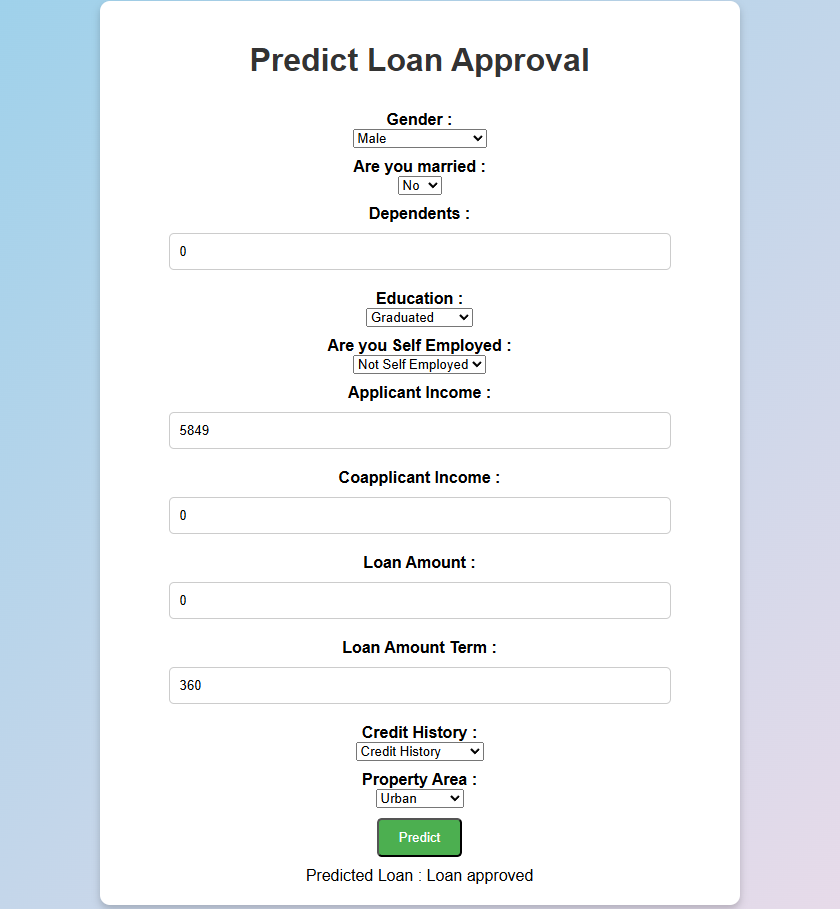

# 🏦 Loan Approval Predictor

Ce projet est une application de **machine learning** déployée via une **API FastAPI**, qui permet de prédire si une demande de prêt bancaire sera **approuvée** ou **refusée**.  
L'application propose une interface simple sous forme de **formulaire HTML**, avec traitement en temps réel grâce à un modèle entraîné sur des données historiques.

L'application est disponible ici : https://loanprediction-wpcl.onrender.com/

## 🚀 Fonctionnalités

- ✅ Prédiction immédiate de l'approbation d’un prêt
- 🌐 Interface web accessible depuis un navigateur
- 🔧 Backend FastAPI performant
- 📦 Conteneurisation via Docker
- 🔁 Intégration continue avec GitHub Actions
- 🔥 Déploiement automatique sur [Render](https://render.com)

---

## 🧠 Modèle de Machine Learning

L'algorithme est entraîné sur des caractéristiques classiques de demande de prêt, telles que :

- `Gender`
- `Married`
- `Dependents`
- `Education`
- `Self_Employed`
- `ApplicantIncome`
- `CoapplicantIncome`
- `LoanAmount`
- `Loan_Amount_Term`
- `Credit_History`
- `Property_Area`

> Plusieurs modèles ont été comparés (Logistic Regression, SVC, Random Forest, etc.), et le meilleur a été sélectionné selon la **précision (accuracy)**.

---

## 📁 Structure du projet

LoanPrediction/

├── main.py               # Application FastAPI

├── training/                # Fichier de training du model + model.pkl + scaler.pkl

├── static/               # Contient les fichiers HTML (index + formulaire + css)

├── training/                # Fichiers de training du model + model.pkl + scaler.pkl

├── images/ 

├── Dockerfile

├── requirements.txt        # Fichier liste des librairies requises

├── test_app.py           # Fichier de test de l'application

├── test.unit.py            # Fichier de test du model

├── .dockerignore

├── .gitignore

└── README.md

---

## Galerie

Voici un aperçu de l'interface utilisateur :

  

